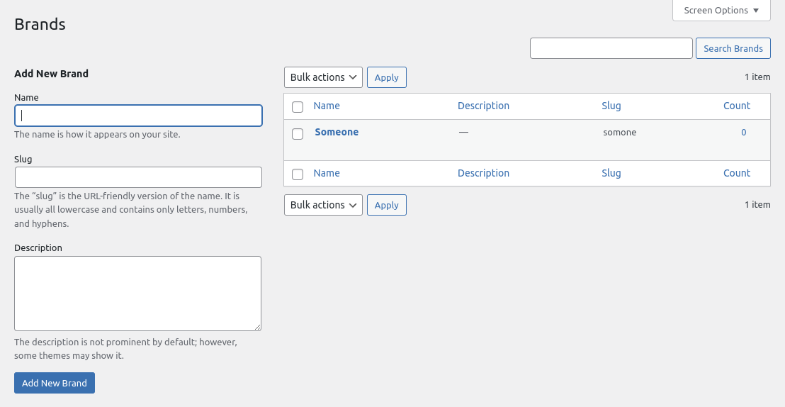

## Car_Brand_Taxonomy.php

As with the `Car_Post_Type`, this taxonomy extends from the similar [Taxonomy](https://perique.info/module/Registerables/#taxonomy) class. This allows us to define the taxonomy, while allowing us to inject various services and dependencies.

### [Injected Services](https://perique.info/core/DI/)

* [App_Config](https://perique.info/core/App/app_config) - Used to get the taxonomy slug.
* [Translations](#translationsphp) - Used to translate the labels.

```php
public function __construct(
   App_Config $app_config,
   Translations $translations
) {..}
```

### [Defining the Taxonomy](https://perique.info/module/Registerables/#taxonomy)



```php
## Using the constructor

// Key and post types used from App_Config
$this->slug        = $app_config->taxonomies( 'brand' );
$this->object_type = array( $app_config->post_types( 'car' ) );

// Labels from Translation dictionary.
$this->singular    = $translations->tax_singular();
$this->plural      = $translations->tax_plural();
$this->description = $translations->tax_description();

// Ensures the taxonomy is available in the REST API and Gutenberg Editor
$this->show_in_rest = true;
```

We get both the `Brand` Taxonomy Slug and `Car` Post Type Slug from the [App_Config](https://perique.info/core/App/app_config) service. The labels are defined in the [Translations](#translationsphp) service.

> `show_in_rest` needs to be set to true to ensure that the taxonomy is available in block editor. Can be omitted if the post type using the taxonomy is not [using the block editor](https://perique.info/module/Registerables/docs/Post-Type#gutenberg).
