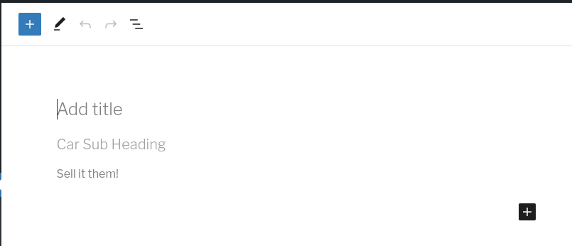

## Car_Post_Type.php

This class defines the `Car` post type. It extends the [Post_Type](https://perique.info/module/Registerables/#post-type) class, which allows us to define a post type, while allowing us to inject various services and dependencies.

### [Injected Services](https://perique.info/core/DI/)

* [App_Config](https://perique.info/core/App/app_config) - Used to get the post type slug.
* [Translations](translations.md) - Used to translate the labels.
* [Car_Details_Meta](car-details-meta.md) - Service that provides the meta data definiens and the accompanying [Meta Box](https://perique.info/module/Registerables/#meta-box) for the post type.

```php
public function __construct(
   App_Config $app_config,
   Translations $translations,
   Car_Details_Meta $car_details_meta
) {..}
```

### [Defining the Post_Type](https://perique.info/module/Registerables/#post-type)



As per the definable fields of the [Post_Type](https://perique.info/module/Registerables/docs/Post-Type) class, we can define the following.

```php
## As Properties
public string $dashicon = 'dashicons-car';
public ?bool $gutenberg = true;
public array $supports  = array( 'editor', 'title', 'thumbnail' );

## Using the constructor

// Key and taxonomies used from App_Config
$this->key        = $app_config->post_types( 'car' );
$this->taxonomies = array( $app_config->taxonomies( 'brand' ) );

// Labels from Translation dictionary.
$this->singular    = $translations->cpt_singular();
$this->plural      = $translations->cpt_plural();
$this->description = $translations->cpt_description();

// Define the template for the post type.
$this->template = array(
   array(
      'core/heading',
      array(
         'placeholder' => $translations->cpt_template_sub_heading_placeholder(),
      ),
   ),
   array(
      'core/paragraph',
      array(
         'placeholder' => $translations->cpt_template_sell_it_placeholder(),
      ),
   ),
);
```

The [Car Brand Taxonomy](car-brand-taxonomy.md) is added to the post type, so that we can assign a brand to the car.