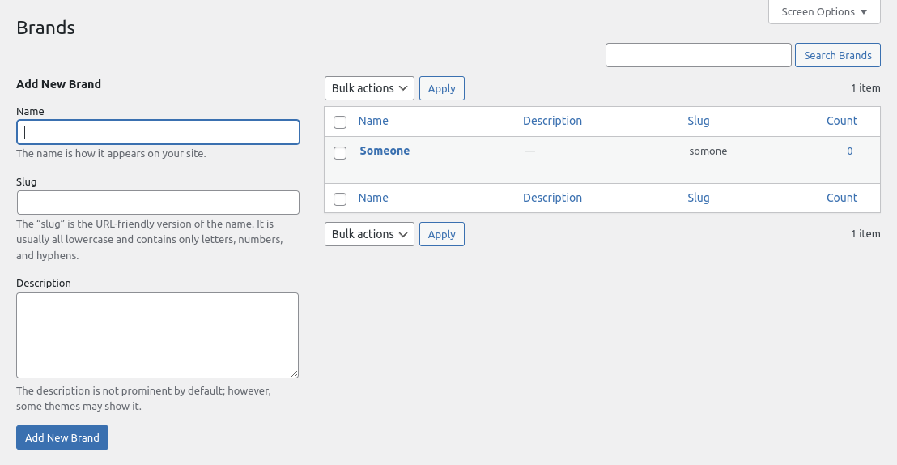

# Gin0115 Example Registerables Plugin

A simple plugin that shows how you can create a custom post, with custom fields, and a custom taxonomy. Above is acheived using the [Registerables](https://github.com/Pink-Crab/Perique-Registerables) module for the [Perique Plugin Framework](https://github.com/Pink-Crab/Perique-Framework).

, with the defined block template.")

# Explanation

* [Plugin File](docs/plugin.md)
* [Car_Post_Type.php](docs/car-post-type.md)
* [Car_Brand_Taxonomy.php](docs/car-brand-taxonomy.md)
* [Car_Details_Meta.php](docs/car-details-meta.md)
* [Translations.php](docs/translations.md)

# Installation

* Clone the repo
* Run `composer install --no-dev --optimize-autoloader`
* Activate the plugin
* Profit?